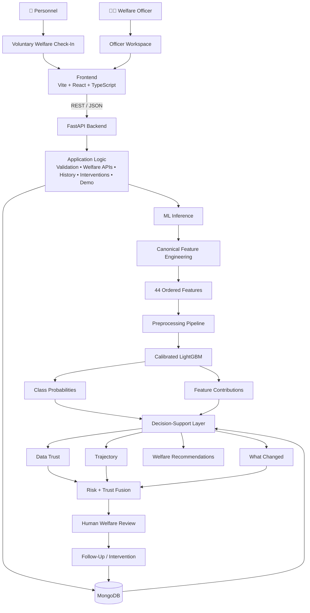

# 🏗️ Manobal-AI Architecture

> ## AI-Powered Personnel Welfare Signal & Human-in-the-Loop Decision-Support Architecture
>
> **AI = SIGNAL**  
> **HUMAN = DECISION**

---

## 📌 1. Architecture Overview

Manobal-AI follows a **modular, backend-authoritative architecture** in which:

- The **frontend** handles user interaction and presentation.
- The **FastAPI backend** owns application logic, validation, orchestration, and ML inference.
- **MongoDB** stores personnel, welfare, assessment, intervention, and historical application data.
- The **ML layer** generates welfare-risk signals and supporting evidence.
- The **decision-support layer** adds data trust, longitudinal context, trajectory analysis, “What Changed”, and rule-based recommendations.
- **Human welfare personnel** remain responsible for interpretation, review, and follow-up.

The architecture is intentionally designed around one core boundary:

```text
┌──────────────────────────────────────────────┐
│                                              │
│              🤖 AI = SIGNAL                  │
│                                              │
│                 ↓                            │
│                                              │
│          🧑‍💼 HUMAN = DECISION              │
│                                              │
└──────────────────────────────────────────────┘
```

The system therefore stops before autonomous welfare action.

---

# 🧭 2. Architectural Goals

The architecture is designed to achieve the following goals:

1. **Keep ML inference server-side**
2. **Keep business logic authoritative in the backend**
3. **Separate model prediction from platform heuristics**
4. **Provide historical context around predictions**
5. **Keep welfare actions under human control**
6. **Support future scaling without unnecessary complexity**
7. **Maintain a clear boundary between prototype functionality and production requirements**

---

# 🗺️ 3. Architecture at a Glance



---

# 📌 4. High-Level Architecture

```text
┌─────────────────────────────────────────────────────────────────────┐
│                         👥 USER LAYER                              │
│                                                                     │
│       👤 Personnel                         🧑‍💼 Welfare Officer      │
│                                                                     │
│       Voluntary Check-In                   Officer Workspace        │
│       Weekly Records                       Case Review              │
│       Personal History                     Intervention Desk        │
└───────────────────────────────┬─────────────────────────────────────┘
                                │
                                ▼
┌─────────────────────────────────────────────────────────────────────┐
│                       🎨 FRONTEND LAYER                            │
│                                                                     │
│                    Vite + React + TypeScript                        │
│                                                                     │
│ Personnel UI │ Officer UI │ Analysis │ Insights │ Ethics           │
└───────────────────────────────┬─────────────────────────────────────┘
                                │
                           REST / JSON
                                │
                                ▼
┌─────────────────────────────────────────────────────────────────────┐
│                       ⚡ BACKEND LAYER                             │
│                                                                     │
│                         FastAPI                                   │
│                                                                     │
│ Welfare APIs │ Prediction │ History │ Interventions │ Demo         │
└───────────────┬───────────────────────────────┬─────────────────────┘
                │                               │
                ▼                               ▼
┌──────────────────────────────┐    ┌────────────────────────────────┐
│        🧠 ML INFERENCE       │    │          🗄️ MONGODB             │
│                              │    │                                │
│ Feature Engineering          │    │ Personnel                      │
│ Preprocessing                │    │ Welfare Records                │
│ Calibrated LightGBM          │    │ Risk Assessments               │
│ Class Probabilities          │    │ Intervention Records             │
│ Feature Contributions        │    │ Historical Data                 │
└──────────────┬───────────────┘    └────────────────────────────────┘
               │
               ▼
┌─────────────────────────────────────────────────────────────────────┐
│                 🛡️ DECISION-SUPPORT LAYER                          │
│                                                                     │
│ Risk Signal │ Data Trust │ Trajectory │ What Changed │ Rules       │
│                                                                     │
│                    Risk + Trust Fusion                             │
└───────────────────────────────┬─────────────────────────────────────┘
                                │
                                ▼
                     🧑‍💼 HUMAN WELFARE REVIEW
                                │
                                ▼
                     🤝 FOLLOW-UP / INTERVENTION
```

---

# 🧩 5. Architectural Layers

Manobal-AI is organized into five primary layers:

```text
┌────────────────────────────────────┐
│ 1. User Interaction Layer          │
├────────────────────────────────────┤
│ 2. Frontend Application Layer      │
├────────────────────────────────────┤
│ 3. Backend Application Layer       │
├────────────────────────────────────┤
│ 4. ML / Decision-Support Layer     │
├────────────────────────────────────┤
│ 5. Persistence Layer               │
└────────────────────────────────────┘
```

| Layer | Primary Technology | Responsibility |
|---|---|---|
| 👥 User Interaction | Browser | Personnel and welfare-officer workflows |
| 🎨 Frontend | React + TypeScript + Vite | Presentation and interaction |
| ⚡ Backend | FastAPI | APIs, validation, workflows and orchestration |
| 🧠 ML / Decision Support | LightGBM + Python application logic | Risk inference and contextual analysis |
| 🗄️ Persistence | MongoDB | Application and historical data |

---

# 1️⃣ User Interaction Layer

Two primary user roles interact with the prototype.

## 👤 Personnel

The personnel workflow provides:

```text
Voluntary Check-In
       ↓
Weekly Welfare Records
       ↓
Run AI Analysis
       ↓
View Welfare Signal
       ↓
View History / Trajectory
       ↓
View Recommendations
```

### Responsibilities

- Provide voluntary welfare information
- Review personal records
- Run an AI-assisted analysis
- View historical context
- Review generated recommendations

---

## 🧑‍💼 Welfare Officer

The officer workflow provides:

```text
Officer Workspace
       ↓
Latest Assessments
       ↓
Review Risk + Trust
       ↓
Inspect History
       ↓
Understand What Changed
       ↓
Human Review
       ↓
Record Intervention
```

### Responsibilities

- Review available assessments
- Inspect supporting context
- Review historical trajectory
- Evaluate data trust
- Understand meaningful changes
- Make the human welfare decision
- Record appropriate follow-up/intervention

> **Prototype boundary:** The current prototype uses a local browser role switch for demonstration rather than production authentication or RBAC.

---

# 2️⃣ Frontend Application Layer

The frontend is implemented using:

```text
Vite
  +
React
  +
TypeScript
```

## Frontend Responsibilities

The frontend is responsible for:

- User interaction
- Form/input collection
- Data visualization
- Personnel workflows
- Officer workflows
- Analysis presentation
- Insights presentation
- Ethics information

### API Communication

The frontend communicates with the backend using relative API paths:

```text
/api/...
```

The Vite development server proxies these requests to:

```text
http://localhost:8001
```

### Frontend Flow

```text
React UI
   │
   ▼
Frontend API Request
   │
   ▼
/api/...
   │
   ▼
Vite Proxy
   │
   ▼
FastAPI
```

### Security Boundary

The frontend **does not execute the ML model**.

It also does not act as the authoritative source for:

- Canonical feature generation
- Database access
- Model inference
- Authoritative welfare calculations
- Direct intervention execution

---

# 3️⃣ Backend Application Layer

The backend is implemented using **FastAPI**.

### Main Entry Point

```text
backend/server.py
```

The backend acts as the **central application authority**.

## Backend Responsibilities

```text
API Routing
Input Validation
Welfare Workflows
Model Inference Orchestration
Feature Engineering
Data Persistence
Historical Assessment Retrieval
Intervention Recording
Demo Data Seeding
Model Information
```

### Backend Flow

```text
HTTP Request
     │
     ▼
FastAPI Route
     │
     ▼
Validation
     │
     ▼
Application Logic
     │
     ├────────────────┐
     ▼                ▼
 ML Inference      MongoDB
     │                │
     └────────┬───────┘
              ▼
         API Response
```

---

# 4️⃣ ML / Decision-Support Layer

The ML system maintains a strict architectural separation between:

```text
┌───────────────────────────────┐
│       TRAINED MODEL           │
└──────────────┬────────────────┘
               │
               │ separate from
               ▼
┌───────────────────────────────┐
│      PLATFORM LOGIC           │
└───────────────────────────────┘
```

## 🧠 Trained Components

```text
Preprocessing Pipeline
        +
Calibrated LightGBM
        +
Feature Contributions
```

## ⚙️ Platform Components

```text
Data Trust
Trajectory
Early Warning
What Changed
Risk + Trust Fusion
Welfare Recommendations
```

The platform does **not** treat these heuristics as additional trained models.

---

# 🧠 6. Model Inference Architecture

The current model expects:

```text
44 numerical features
```

in the exact order defined by:

```text
artifacts/model_metadata.json
```

## Current Model Metadata

```text
Model Version:    0.2.0-sih-final
Feature Version:  1.1.0
Feature Count:    44
```

## Complete Inference Flow

```text
                    RAW DATA
                       │
                       ▼
              Weekly Welfare Records
                       │
                       ▼
                 POST /api/predict
                       │
                       ▼
             Server-Side Validation
                       │
                       ▼
          Canonical Feature Engineering
                       │
                       ▼
              44 Ordered Features
                       │
                       ▼
          Preprocessing Compatibility
                 Adapter / Pipeline
                       │
                       ▼
              Calibrated LightGBM
                       │
             ┌─────────┴─────────┐
             ▼                   ▼
      Class Probabilities   Feature Contributions
             │                   │
             └─────────┬─────────┘
                       ▼
                Welfare Signal
                       │
              ┌────────┼────────┐
              ▼        ▼        ▼
             LOW    MODERATE    HIGH
```

---

# 🔐 7. Why Feature Engineering Is Server-Side

The frontend sends:

```text
raw_records
```

rather than a pre-engineered feature vector.

The backend then performs:

```text
Raw Records
    ↓
Canonical Feature Engineering
    ↓
44 Features
    ↓
Model
```

Pre-engineered client-supplied vectors are rejected.

This architecture provides:

- ✅ Consistent feature generation
- ✅ Correct feature ordering
- ✅ Reduced client-side manipulation
- ✅ One authoritative inference pipeline
- ✅ Easier model version management

---

# 🔍 8. Decision-Support Layer

The model output is passed into a second layer that provides contextual information.

```text
                    MODEL
                      │
                      ▼
                 Risk Signal
                      │
          ┌───────────┼───────────┐
          ▼           ▼           ▼
      Data Trust    History    What Changed
          │           │           │
          └───────────┼───────────┘
                      ▼
               Risk + Trust Fusion
                      │
            ┌─────────┼─────────┐
            ▼         ▼         ▼
         REVIEW    MONITOR   VERIFY DATA
```

This layer is **not another ML model**.

It is application-level decision-support logic.

---

# 📊 9. Risk Signal Layer

The ML classifier produces:

```text
LOW
MODERATE
HIGH
```

The signal represents **model-indicated welfare risk**.

It is explicitly not:

```text
❌ A diagnosis
❌ A psychological assessment
❌ A disciplinary classification
❌ A self-harm prediction
❌ An autonomous decision
```

---

# 🧪 10. Data Trust Layer

The platform evaluates the quality and trustworthiness of the available input data.

## Conceptual Flow

```text
Input Data
    │
    ▼
Data Completeness / Consistency
    │
    ▼
Data Trust Heuristic
    │
    ▼
Interpretation Context
```

The resulting trust information is combined with the model signal:

```text
Risk Signal + Data Trust
          ↓
    Contextual Result
```

Possible platform outcomes include:

```text
REVIEW_RECOMMENDED
MONITOR
VERIFY_DATA
```

These are **application-level decision-support states**.

---

# 📈 11. Historical Context Layer

MongoDB stores previous assessments.

The historical layer retrieves those assessments and derives:

```text
Current Assessment
       +
Previous Assessments
       ↓
Historical Timeline
       ↓
Trajectory
       ↓
Early-Warning Logic
       ↓
What Changed
```

### Architectural Distinction

Historical trajectory and early-warning calculations are **platform logic**, not separate trained models.

---

# 🔄 12. “What Changed” Architecture

The “What Changed” component compares relevant information between assessment periods.

```text
Previous Period
      │
      ▼
Historical Features
      │
      │
      ▼
Current Period
      │
      ▼
Current Features
      │
      └──────────────┐
                     ▼
                 Comparison
                     │
                     ▼
              Meaningful Changes
                     │
                     ▼
               Officer Context
```

This provides additional contextual information around the current signal.

---

# 💡 13. Recommendation Layer

The current prototype uses rule-based welfare recommendations.

```text
Risk Signal
     +
Data Trust
     +
Historical Context
     +
Platform Rules
     ↓
Welfare Recommendation
```

The recommendation layer does not independently diagnose or make personnel decisions.

---

# 🗄️ 14. Persistence Architecture

MongoDB acts as the application's persistence layer.

```text
┌──────────────────────────────────────┐
│              MONGODB                 │
├──────────────────────────────────────┤
│ Personnel                            │
│ Welfare Records                      │
│ Risk Assessments                     │
│ Intervention Records                 │
│ Historical Assessments               │
└──────────────────────────────────────┘
```

## Logical Relationships

```text
Personnel
   │
   ├── Welfare Records
   │
   ├── Risk Assessments
   │
   └── Interventions
```

MongoDB therefore supports both:

- Current application state
- Longitudinal historical context

---

# 🧑‍💼 15. Intervention Architecture

Interventions remain outside autonomous model execution.

```text
Model
 │
 ▼
Signal
 │
 ▼
Officer Workspace
 │
 ▼
Human Review
 │
 ▼
Officer Decision
 │
 ▼
Intervention Desk
 │
 ▼
MongoDB
```

### Critical Boundary

> **The ML model cannot directly execute a welfare intervention.**

---

# 🌐 16. API Architecture

The major API boundary is:

```text
Frontend
    │
    ▼
  /api
    │
    ▼
FastAPI
```

## Core Endpoints

| Method | Endpoint | Responsibility |
|---|---|---|
| `POST` | `/api/predict` | Run model inference from raw weekly records |
| `POST` | `/api/demo/seed` | Create synthetic demonstration records and historical assessments |
| `GET` | `/api/demo/personnel` | Retrieve demo personnel and stored assessment history |
| `GET` | `/api/model-info` | Provide model/artifact information |

Additional application routes support:

```text
Personnel
Officer Workspace
History
Interventions
Welfare Records
```

---

# 📦 17. Model Artifact Architecture

The inference layer loads serialized artifacts from:

```text
artifacts/
```

## Artifact Structure

```text
artifacts/
├── risk_model.pkl
├── preprocessing_pipeline.pkl
├── baseline_model.pkl
├── model_metadata.json
└── MODEL_CARD.md
```

## Runtime Flow

```text
FastAPI Startup
      │
      ▼
InferenceEngine
      │
      ├── risk_model.pkl
      ├── preprocessing_pipeline.pkl
      ├── baseline_model.pkl
      └── model_metadata.json
      │
      ▼
Ready for /api/predict
```

The artifact directory can be configured through:

```text
MODEL_ARTIFACT_DIR
```

---

# 🧩 18. Repository Architecture

```text
ProtoMano/
│
├── artifacts/
│   ├── risk_model.pkl
│   ├── preprocessing_pipeline.pkl
│   ├── baseline_model.pkl
│   ├── model_metadata.json
│   └── MODEL_CARD.md
│
├── backend/
│   ├── server.py
│   │
│   ├── routers/
│   │   └── Welfare API Routes
│   │
│   ├── lib/
│   │   ├── DB Client
│   │   └── InferenceEngine
│   │
│   ├── tests/
│   │
│   └── requirements.txt
│
├── frontend/
│   ├── src/
│   ├── package.json
│   └── yarn.lock
│
├── tests/
│   └── Playwright Workspace
│
├── memory/
│   └── SPEC.md
│
└── README.md
```

---

# 🔐 19. Security Boundary

The architecture intentionally keeps sensitive operations on the backend.

```text
                    FRONTEND
                       │
                       │ User Input
                       ▼
                  FASTAPI API
                       │
             ┌─────────┴─────────┐
             ▼                   ▼
        Application          ML Inference
          Logic                   │
             │                    ▼
             │              Risk Signal
             │                    │
             └─────────┬──────────┘
                       ▼
                    MongoDB
```

The frontend is not trusted with:

- ❌ Model execution
- ❌ Canonical feature generation
- ❌ Database access
- ❌ Direct intervention execution
- ❌ Authoritative welfare calculations

---

# 🛡️ 20. Human Oversight Boundary

The most important architectural boundary is:

```text
                ┌───────────────┐
                │   AI SYSTEM   │
                └───────┬───────┘
                        │
                        ▼
                ┌───────────────┐
                │ WELFARE SIGNAL│
                └───────┬───────┘
                        │
                        ▼
              ┌───────────────────┐
              │ CONTEXT + DATA    │
              │      TRUST        │
              └─────────┬─────────┘
                        │
                        ▼
                ┌───────────────┐
                │ HUMAN OFFICER  │
                └───────┬───────┘
                        │
                        ▼
                ┌───────────────┐
                │ HUMAN REVIEW   │
                └───────┬───────┘
                        │
                        ▼
                ┌───────────────┐
                │ FOLLOW-UP     │
                │ / INTERVENTION│
                └───────────────┘
```

The system intentionally stops before autonomous welfare action.

---

# 🔄 21. Complete End-to-End Architecture

```text
                         ┌───────────────┐
                         │   PERSONNEL   │
                         └───────┬───────┘
                                 │
                         Voluntary Data
                                 │
                                 ▼
┌─────────────────────────────────────────────────────────────────┐
│                         REACT FRONTEND                          │
│                    Vite + React + TypeScript                    │
└───────────────────────────────┬─────────────────────────────────┘
                                │
                              REST
                                │
                                ▼
┌─────────────────────────────────────────────────────────────────┐
│                         FASTAPI BACKEND                         │
│                                                                 │
│ Validation │ Welfare APIs │ History │ Interventions │ Demo      │
└──────────────┬──────────────────────────────┬───────────────────┘
               │                              │
               ▼                              ▼
┌──────────────────────────┐       ┌──────────────────────────────┐
│      ML INFERENCE        │       │           MONGODB             │
│                          │       │                              │
│ Feature Engineering      │       │ Personnel                    │
│ Preprocessing            │       │ Welfare Records              │
│ Calibrated LightGBM      │       │ Risk Assessments             │
│ Probabilities            │       │ Interventions                │
│ Feature Contributions    │       │ Historical Data              │
└──────────────┬───────────┘       └──────────────────────────────┘
               │
               ▼
┌─────────────────────────────────────────────────────────────────┐
│                  DECISION-SUPPORT LOGIC                         │
│                                                                 │
│ Data Trust │ Trajectory │ What Changed │ Early Warning          │
│                                                                 │
│                    Risk + Trust Fusion                          │
└───────────────────────────────┬─────────────────────────────────┘
                                │
                                ▼
                       ┌─────────────────┐
                       │ WELFARE OFFICER │
                       │                 │
                       │ Human Review    │
                       └────────┬────────┘
                                │
                                ▼
                       Intervention Desk
                                │
                                ▼
                             MongoDB
```

---

# ⚡ 22. Why This Architecture?

## 1. Backend as the Source of Truth

The backend controls:

```text
Feature Engineering
Model Inference
Welfare Records
Historical Assessments
Intervention Records
```

---

## 2. Model Isolation

ML artifacts are isolated from the frontend and loaded through the backend inference engine.

```text
Frontend
   ✕
   │
   │ direct model access
   │
   ✕

Frontend
   │
   ▼
FastAPI
   │
   ▼
InferenceEngine
   │
   ▼
ML Artifacts
```

---

## 3. Clear Separation of Concerns

```text
Frontend
   → Presentation

FastAPI
   → Application Logic

ML Layer
   → Prediction

MongoDB
   → Persistence

Decision-Support Layer
   → Context / Heuristics

Human Officer
   → Final Welfare Decision
```

---

## 4. Human-Centered Design

The architecture prevents the model from becoming an autonomous action system.

```text
AI
 ↓
Signal
 ↓
Context
 ↓
Human Review
 ↓
Action
```

---

## 5. Future Scalability

The current modular structure can later support:

```text
Authentication Service
       │
       ▼
Welfare Service
       │
       ▼
ML Model Service
       │
       ▼
Data / Analytics Layer
       │
       ▼
Monitoring & Audit
```

without requiring the prototype to begin with unnecessary microservice complexity.

---

# 🚀 23. Future Production Architecture

The prototype can evolve toward:

```text
                         API Gateway
                              │
             ┌────────────────┼────────────────┐
             │                │                │
             ▼                ▼                ▼
       Authentication     Welfare API     Officer API
             │                │                │
             └────────────────┼────────────────┘
                              │
                              ▼
                    Decision-Support Layer
                              │
              ┌───────────────┼───────────────┐
              ▼               ▼               ▼
          ML Serving       History         Data Trust
              │               │               │
              └───────────────┼───────────────┘
                              ▼
                           Database
                              │
                 ┌────────────┴────────────┐
                 ▼                         ▼
             Monitoring                Audit Logs
```

### Potential Production Infrastructure

```text
Redis
Background Workers
Model Serving
Observability
Audit Logging
Data Quality Monitoring
Model Drift Detection
Secure Cloud Infrastructure
```

---

# 🧪 24. Prototype vs Production

| Component | Current Prototype | Production Direction |
|---|---|---|
| Authentication | Local role switch | Secure authentication |
| RBAC | Not implemented | Production RBAC |
| Database | MongoDB | Hardened managed database |
| ML | Serialized LightGBM | Versioned model serving |
| Data | Synthetic | Authorized validated data |
| Inference | FastAPI process | Dedicated/scalable serving if required |
| Monitoring | Basic | Full observability |
| Audit | Limited | Comprehensive audit trail |
| Security | Prototype-level | Security-reviewed deployment |
| Welfare Action | Human-led | Governed human-led workflow |

---

# 🧱 25. Architectural Design Principles

### 1. AI is a Signal Generator

The model provides a welfare-risk signal rather than an autonomous decision.

### 2. Human Review is Mandatory

The welfare officer remains responsible for interpreting the signal and determining appropriate follow-up.

### 3. Server-Side Inference

Feature engineering and ML inference remain on the backend.

### 4. One Canonical Feature Pipeline

The same feature ordering defined by model metadata is preserved during inference.

### 5. Platform Logic is Separated from ML

Trajectory, data trust, early warning, and recommendations are not represented as additional trained models.

### 6. Database-Backed History

Historical assessments are persisted so current signals can be interpreted over time.

### 7. Privacy-Aware Design

Sensitive welfare information should be protected through access control, minimization, secure storage, and appropriate retention policies in production.

### 8. Prototype Transparency

Synthetic data, local role switching, and other prototype limitations are explicitly separated from production capabilities.

### 9. Avoid Premature Complexity

The architecture can scale later without introducing microservices, queues, or distributed infrastructure before they are actually needed.

---

# 📊 26. Architecture Summary

```text
┌────────────────────────────────────────────────────┐
│                    MANOBAL-AI                      │
├────────────────────────────────────────────────────┤
│                                                    │
│  React + TypeScript                                │
│           ↓                                        │
│  FastAPI Backend                                   │
│           ↓                                        │
│  Feature Engineering                               │
│           ↓                                        │
│  44-Feature Pipeline                               │
│           ↓                                        │
│  Calibrated LightGBM                              │
│           ↓                                        │
│  Welfare-Risk Signal                              │
│           ↓                                        │
│  Data Trust + Historical Context                  │
│           ↓                                        │
│  Risk + Trust Fusion                              │
│           ↓                                        │
│  Human Welfare Officer                            │
│           ↓                                        │
│  Follow-Up / Intervention                         │
│           ↓                                        │
│  MongoDB                                          │
│                                                    │
└────────────────────────────────────────────────────┘
```

---

# 🎯 27. Final Architectural Boundary

```text
                 ┌───────────────────────┐
                 │     MACHINE LEARNING  │
                 │                       │
                 │  Signal + Evidence    │
                 └───────────┬───────────┘
                             │
                             ▼
                 ┌───────────────────────┐
                 │   DECISION SUPPORT    │
                 │                       │
                 │ Context + Trust +     │
                 │ History + Changes     │
                 └───────────┬───────────┘
                             │
                             ▼
                 ┌───────────────────────┐
                 │     HUMAN REVIEW      │
                 │                       │
                 │ Interpretation +      │
                 │ Follow-Up             │
                 └───────────────────────┘
```

> ## 🧠 Manobal-AI is architected so that machine learning provides **evidence and context**, while human welfare personnel retain responsibility for **interpretation and action**.

---

<div align="center">

### AI-Assisted • Human-Led • Evidence-Aware

**Manobal-AI Architecture**

</div>
